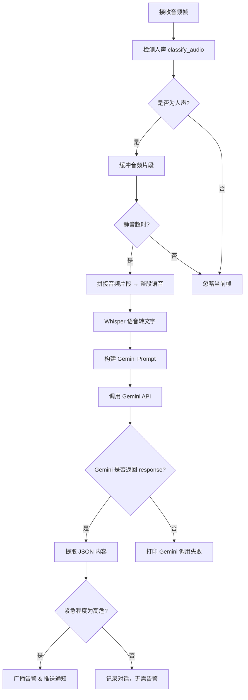

# IAmListening
I Am Listening 是一个围绕声音处理的智能语音辅助助手。

我们在本次开发中完成了移动端、服务端、以及硬件侧的开发。
移动端 边缘部署了gemma3-1b-it-int4模型，同时兼容Gemini 2.5 flash API。
在服务端，目前已接入Gemini 2.5 flash API。

## 项目结构说明
关于Google gemma3 与 gemini 调用相关核心代码已抽出放入ai_core目录
``` shell
IAmListening/
├── ai_core/                  # Google 大模型调用相关核心代码
│   ├── app/                  # IOS APP 端 包含gemma3 gemini 调用代码
│   └── server/               # 硬件服务端 包含gemini 
├── project/                  # 项目全部代码
│   ├── app/                  # APP 端代码
│   ├── hardware/             # 硬件控制层代码
│   └── server/               # 服务端代码
├── README.md                 # 项目说明文档
```

## APP流程图

## server流程图

## Demo启动所需依赖

1. 下载所需文件

YAMNet
`https://www.kaggle.com/models/google/yamnet/tfLite`

Whisper，参考examples/whisper.swiftui目录下，生成 build-apple/whisper.xcframework拖入IOS项目
`https://github.com/ggml-org/whisper.cpp`

Gemma3参考, 同时参考
`https://ai.google.dev/edge/mediapipe/solutions/genai/llm_inference?hl=zh-cn#models`

2. 按照项目内`README.md`文档进行配置即可

## demo演示
硬件演示（校园暴力场景）
<video controls height='100%' width='100%' src="https://i-am-listening.oss-cn-hangzhou.aliyuncs.com/%E4%BA%A7%E5%93%81%E5%B1%95%E7%A4%BA%E6%9C%80%E7%BB%88%E7%89%88.mov"></video>

APP演示（校园暴力场景）
<video controls height='100%' width='100%' src="https://i-am-listening.oss-cn-hangzhou.aliyuncs.com/%E6%A0%A1%E5%9B%AD%E9%9C%B8%E5%87%8C%E7%B4%A0%E6%9D%90%E6%9C%80%E7%BB%88%E7%89%88.mov"></video>

APP演示（就医场景）
<video controls height='100%' width='100%' src="https://i-am-listening.oss-cn-hangzhou.aliyuncs.com/%E9%81%B5%E5%8C%BB%E5%98%B1%E6%9C%80%E7%BB%88%E7%89%88.mov"></video>
