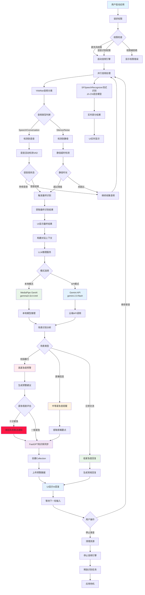

# IAmListening-Voice 智能音频助手（心声）

一个基于 iOS 的实时音频识别与智能对话应用，集成了音频分类、流式语音识别和大语言模型对话功能。

## 🚀 项目概述

**IAmListening** 是一个先进的音频处理应用，能够实时识别音频内容、进行语音转文字，并通过AI助手提供智能回复。应用特别针对校园暴力检测、医嘱信息识别等场景进行了优化。

### 核心功能

- 🎵 **实时音频分类** - 使用 YAMNet 模型识别音频类型
- 🗣️ **流式语音识别** - 基于 SFSpeechRecognizer 的实时语音转文字
- 🤖 **智能AI对话** - 集成 Gemini API 和本地 LLM 模型
- 🚨 **场景识别预警** - 自动识别校园暴力、医嘱信息等关键场景
- 📊 **知识库同步** - 与 FastGPT 知识库集成，记录重要信息

## 🏗️ 项目架构

### 核心组件

```plaintext
IAmListeningVoice/
├── .env.example                       # 🔧 环境变量配置模板
├── .gitignore                         # 📝 Git 忽略文件配置
├── IAmListening.xcodeproj/            # 📱 Xcode 项目文件
│   ├── project.pbxproj                # 项目配置文件
│   ├── project.xcworkspace/           # 项目工作空间
│   └── xcshareddata/                  # 共享数据和方案
├── IAmListening.xcworkspace/          # 🔨 CocoaPods 工作空间
│   ├── contents.xcworkspacedata       # 工作空间配置
│   └── xcshareddata/                  # Swift Package Manager 配置
├── IAmListening/                      # 🔥 主应用模块
│   ├── Assets.xcassets/               # 🎨 应用资源文件
│   │   ├── AccentColor.colorset/      # 主题色配置
│   │   ├── AppIcon.appiconset/        # 应用图标
│   │   └── Contents.json              # 资源清单
│   ├── IAmListeningApp.swift          # 📱 应用入口和生命周期管理
│   ├── ContentView.swift              # 🎨 主界面视图和交互逻辑
│   ├── Info.plist                     # ⚙️ 应用配置和权限声明
│   ├── Item.swift                     # 📦 数据项模型
│   ├── models/                        # 🤖 AI模型和数据模型层
│   │   ├── LLMInferenceService.swift  # 🧠 LLM推理服务核心
│   │   ├── Speech.swift               # 🗣️ 语音识别模型
│   │   ├── Whisper.swift              # 🎙️ Whisper语音转文本模型
│   │   ├── WhisperContext.swift       # 📝 Whisper上下文管理
│   │   └── Yamnet.swift               # 🔊 YAMNet音频分类模型
│   ├── service/                       # 🛠️ 业务服务层
│   │   ├── Audio.swift                # 🎵 音频处理核心服务
│   │   └── FastGPTService.swift       # 🚀 FastGPT API集成服务
│   └── utils/                         # 🔧 工具类和辅助功能
│       └── Recorder.swift             # 🎤 音频录制工具
├── Podfile                            # 📋 CocoaPods 依赖配置
├── Podfile.lock                       # 🔒 依赖版本锁定文件
└── TFLiteWrapper/                     # 🔗 TensorFlow Lite 封装层
    └── TFLiteWrapper.swift            # TensorFlow Lite Swift 接口
```

### 📂 目录详细说明

#### 🔥 核心应用模块 (`IAmListening/`)
- **应用框架**:
  - `IAmListeningApp.swift`: SwiftUI 应用程序入口，负责应用生命周期和初始化
  - `ContentView.swift`: 主用户界面，包含实时语音监听状态和模式切换功能
  - `Item.swift`: 核心数据模型，用于数据持久化和状态管理
  - `Info.plist`: 应用配置文件，包含麦克风权限、网络访问等关键权限声明

- **🤖 AI模型层 (`models/`)**:
  - `LLMInferenceService.swift`: 多模式AI推理引擎，支持本地和云端LLM推理
  - `Speech.swift`: 语音识别核心模型，处理实时语音输入
  - `Whisper.swift`: OpenAI Whisper模型集成，提供高精度语音转文本
  - `WhisperContext.swift`: Whisper模型上下文管理和配置
  - `Yamnet.swift`: Google YAMNet音频分类模型，用于环境音频识别

- **🛠️ 服务层 (`service/`)**:
  - `Audio.swift`: 音频处理核心服务，负责音频采集、预处理和分析
  - `FastGPTService.swift`: FastGPT平台API集成，提供云端AI推理能力

- **🔧 工具层 (`utils/`)**:
  - `Recorder.swift`: 音频录制工具，处理实时音频流和录制功能

#### 🔗 技术集成模块
- **TFLiteWrapper/**: TensorFlow Lite Swift封装，为AI模型推理提供底层支持

#### ⚙️ 配置和项目文件
- **环境配置**: `.env.example` 提供API密钥等敏感配置的模板
- **依赖管理**: `Podfile` 和 `Podfile.lock` 管理第三方库依赖
- **Xcode项目**: 使用 `IAmListening.xcworkspace` 打开项目（CocoaPods集成后）
- **资源文件**: `Assets.xcassets/` 包含应用图标、颜色主题等视觉资源

### 技术栈

- **框架**: SwiftUI + AVFoundation + Speech
- **AI模型**: 
  - YAMNet (音频分类)
  - Whisper (语音识别)
  - Gemini 2.0 Flash (对话生成)
  - MediaPipe Tasks GenAI (本地LLM)
- **依赖管理**: CocoaPods
- **最低系统要求**: iOS 15.0+

## ✨ 流式ASR优化

### 主要改进

#### 1. 实时识别显示
- **实时结果**：用户说话时即时显示识别的文字，带有动画效果
- **最终确认**：语音结束后显示最终确认的识别结果
- **视觉区分**：通过不同的UI样式和动画区分实时结果和最终结果

#### 2. 双重音频处理
- **YAMNet分类**：继续用于语音活动检测（VAD）
- **流式ASR**：使用SFSpeechRecognizer进行实时语音识别
- **并行处理**：两个系统同时工作，互不干扰

#### 3. 优化的用户界面
- 新增`StreamingResultCard`组件，专门显示流式识别结果
- 实时结果带有脉动动画效果，提示用户正在识别
- 最终结果以稳定样式显示，便于阅读

### 技术实现

#### 核心组件修改

**Audio.swift**
```swift
// 新增属性
@Published var partialResult: String = ""  // 实时部分识别结果
@Published var finalResult: String = ""    // 最终确认结果

// 流式ASR相关
private let speechRecognizer = SFSpeechRecognizer(locale: Locale(identifier: "zh-CN"))!
private var recognitionRequest: SFSpeechAudioBufferRecognitionRequest?
private var recognitionTask: SFSpeechRecognitionTask?
```

#### 关键特性
1. **shouldReportPartialResults = true**：启用部分结果报告
2. **并行音频流**：同时发送音频到YAMNet和SFSpeechRecognizer
3. **权限管理**：自动请求语音识别和麦克风权限

### 用户体验提升

**之前（批处理模式）**
1. 用户说话
2. 等待语音段结束（2秒静默超时）
3. 处理完整音频段
4. 显示识别结果

**现在（流式模式）**
1. 用户开始说话
2. **立即显示**实时识别结果
3. 持续更新识别内容
4. 语音结束后确认最终结果
5. 触发AI处理

### 工作流程

```
用户点击开始 → 请求权限 → 启动音频引擎 → 启动流式ASR
                                    ↓
音频输入 → YAMNet分类 + SFSpeechRecognizer识别
            ↓              ↓
        语音检测        实时文字显示
            ↓              ↓
        静默检测        最终结果确认
                          ↓
                      触发AI处理
```

## 📊 项目整体流程图



### 流程说明

#### 🎤 音频输入阶段
1. **权限申请**: 获取麦克风和语音识别权限
2. **音频引擎**: 启动AVAudioEngine进行音频采集
3. **并行处理**: 同时发送音频流到YAMNet和SFSpeechRecognizer

#### 🔍 音频分析阶段
1. **YAMNet分类**: 实时分类音频类型（语音、音乐、噪音等）
2. **语音活动检测**: 基于分类结果判断是否为有效语音
3. **流式识别**: SFSpeechRecognizer提供实时文字转换

#### 📝 文字处理阶段
1. **实时显示**: 部分识别结果即时显示给用户
2. **最终确认**: 语音段结束后获取完整识别结果
3. **上下文构建**: 结合历史对话构建完整上下文

#### 🤖 AI分析阶段
1. **模式选择**: 本地模型(gemma3-1b-it-int4)或云端API(gemini-2.0-flash)
2. **场景识别**: 自动识别校园暴力、医嘱信息、日常交流
3. **智能回复**: 根据场景生成相应的建议和回复
4. **紧急评估**: 对高危场景进行紧急程度评估

#### 🚨 预警推送阶段
1. **紧急程度判断**: 评估预警事件的紧急程度
2. **系统推送**: 十分紧急情况下发起系统推送通知
3. **即时响应**: 确保关键信息能够及时传达

#### 📊 数据管理阶段
1. **知识库同步**: 重要信息自动同步到FastGPT
2. **历史记录**: 维护对话历史和分析结果
3. **资源管理**: 及时清理音频资源和识别任务

#### 🔄 循环监听
- 应用持续监听用户语音输入
- 支持连续对话和多轮交互
- 智能管理系统资源和网络请求

## 🔧 API 密钥配置

本项目已将硬编码的 API 密钥替换为环境变量的方式，以提高安全性。请按照以下步骤配置您的 API 密钥。

### 配置方式

#### 方式一：使用环境变量（推荐）

1. **Gemini API Key**
   ```bash
   export GEMINI_API_KEY="your_gemini_api_key_here"
   ```

2. **FastGPT API Token**
   ```bash
   export FASTGPT_API_TOKEN="your_fastgpt_api_token_here"
   ```

#### 方式二：在 Info.plist 中配置

编辑 `IAmListening/Info.plist` 文件，取消注释并填入您的 API 密钥：

```xml
<key>GEMINI_API_KEY</key>
<string>your_gemini_api_key_here</string>
<key>FASTGPT_API_TOKEN</key>
<string>your_fastgpt_api_token_here</string>
```

### 获取 API 密钥

#### Gemini API Key
1. 访问 [Google AI Studio](https://makersuite.google.com/app/apikey)
2. 创建新的 API 密钥
3. 复制密钥并按上述方式配置

#### FastGPT API Token
1. 登录您的 FastGPT 账户
2. 在设置中生成 API Token
3. 复制 Token 并按上述方式配置

### 安全注意事项

1. **不要将 API 密钥提交到版本控制系统**
   - 如果使用 Info.plist 配置，请确保不要将包含真实密钥的文件提交到 Git
   - 建议使用环境变量方式

2. **定期轮换密钥**
   - 定期更新您的 API 密钥以提高安全性

3. **限制密钥权限**
   - 为 API 密钥设置最小必要权限

## 🛠️ 安装与运行

### 环境要求

- Xcode 14.0+
- iOS 15.0+
- CocoaPods

### 安装步骤

1. **克隆项目**
   ```bash
   git clone <repository-url>
   cd IAmListening
   ```

2. **安装依赖**
   ```bash
   pod install
   ```

3. **配置API密钥**
   - 按照上述API密钥配置指南设置您的密钥

4. **打开项目**
   ```bash
   open IAmListening.xcworkspace
   ```

5. **运行应用**
   - 在 Xcode 中选择目标设备
   - 点击运行按钮或按 `Cmd+R`

### 权限配置

应用需要以下权限，已在 `Info.plist` 中配置：

```xml
<key>NSMicrophoneUsageDescription</key>
<string>此应用需要访问麦克风以进行实时语音识别和音频分析</string>
<key>NSSpeechRecognitionUsageDescription</key>
<string>此应用需要使用语音识别功能来实时转换语音为文字</string>
```

## 🎯 核心功能详解

### 1. 音频分类 (YAMNet)

- 使用预训练的 YAMNet 模型
- 实时分类音频内容（语音、音乐、噪音等）
- 用于语音活动检测（VAD）

### 2. 流式语音识别

- 基于 Apple 的 SFSpeechRecognizer
- 支持中文实时识别
- 提供部分结果和最终结果

### 3. 场景识别与预警

应用能够识别以下预定义场景：

- **校园暴力** - 涉及学校环境中的欺凌、威胁、身体伤害等
- **医嘱信息** - 医生给出的治疗建议、用药指导等
- **日常交流** - 普通对话、闲聊等非紧急情况

### 4. AI智能回复

- 支持本地模型和云端API两种模式
- 本地模式：使用 MediaPipe Tasks GenAI
- 云端模式：集成 Gemini 2.0 Flash API
- 自动场景分析和建议生成

### 5. 知识库集成

- 与 FastGPT 知识库同步
- 自动记录重要预警信息
- 支持历史数据查询和分析

## 🚨 注意事项

1. **网络依赖**：SFSpeechRecognizer默认使用云端识别，需要网络连接
2. **权限要求**：首次使用需要用户授权麦克风和语音识别权限
3. **语言设置**：当前配置为中文识别，可根据需要调整
4. **资源消耗**：流式识别会增加一定的CPU和网络使用

## 🔍 故障排除

### 环境变量未生效
- 确保在启动 Xcode 之前设置了环境变量
- 可以在 Xcode 的 Scheme 设置中添加环境变量

### Info.plist 配置未生效
- 检查 XML 格式是否正确
- 确保取消了注释标记
- 重新构建项目

### 语音识别不工作
- 检查麦克风权限是否已授予
- 确认网络连接正常
- 查看控制台日志获取详细错误信息

## 📝 验证配置

启动应用后，如果配置正确，应用将正常运行。如果配置有误，控制台会显示相应的警告信息：

- `警告: 未找到Gemini API Key环境变量或Info.plist配置`
- `警告: 未找到FastGPT API Token环境变量或Info.plist配置`

## 🎉 效果展示

- ⚡ **实时响应**：说话即显示，无需等待
- 🎯 **准确识别**：基于Apple的SFSpeechRecognizer，识别准确率高
- 🎨 **优雅UI**：流畅的动画效果，清晰的状态指示
- 🔄 **智能处理**：自动区分实时结果和最终结果

通过这个项目，用户可以体验到先进的音频处理技术和智能对话功能，特别适用于需要实时音频监控和智能分析的场景。

## 📄 许可证

本项目采用 MIT 许可证，详情请参阅 LICENSE 文件。

## 🤝 贡献

欢迎提交 Issue 和 Pull Request 来改进这个项目！

---

**注意**: 请确保在使用前正确配置所有必需的 API 密钥，并遵守相关服务的使用条款。