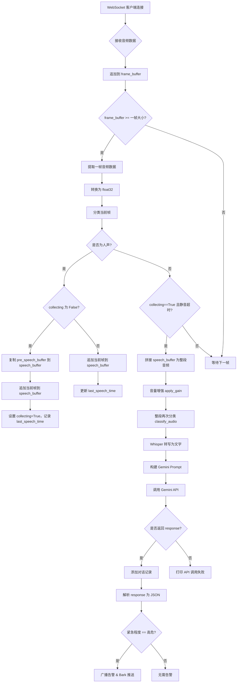

```json
pip3 install -r requirements
# server版本兼容了运行时自动下载模型文件，同时会产生模型缓存
# 如果自行加载可以采用__local后缀的工具脚本
python websocket_server.py
```



```mermaid
flowchart TD
    A[WebSocket 客户端连接] --> B{接收音频数据}
    B --> C[追加到 frame_buffer]
    C --> D{frame_buffer >= 一帧大小?}
    D -- 是 --> E[提取一帧音频数据]
    E --> F[转换为 float32]
    F --> G[分类当前帧]
    G --> H{是否为人声?}

    H -- 是 --> H1{collecting 为 False?}
    H1 -- 是 --> H2[复制 pre_speech_buffer 到 speech_buffer]
    H2 --> H3[追加当前帧到 speech_buffer]
    H3 --> H4[设置 collecting=True，记录 last_speech_time]

    H1 -- 否 --> H5[追加当前帧到 speech_buffer]
    H5 --> H6[更新 last_speech_time]

    H -- 否 --> L{collecting==True 且静音超时?}

    L -- 是 --> M[拼接 speech_buffer 为整段音频]
    M --> N[音量增强 apply_gain]
    N --> O[整段再次分类 classify_audio]
    O --> P[Whisper 转写为文字]
    P --> Q[构建 Gemini Prompt]
    Q --> R[调用 Gemini API]
    R --> S{是否返回 response?}

    S -- 是 --> T[添加对话记录]
    T --> U[解析 response 为 JSON]
    U --> V{紧急程度 == 高危?}
    V -- 是 --> W[广播告警 & Bark 推送]
    V -- 否 --> X[无需告警]

    S -- 否 --> Y[打印 API 调用失败]

    L -- 否 --> Z[等待下一帧]
    D -- 否 --> Z
```